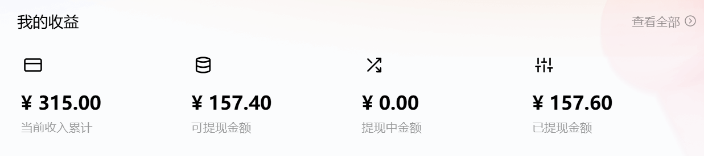
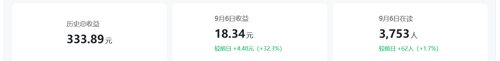

# AI 挣钱第一弹：音乐与小说的个人实战

从生成一首歌、写出一篇小说，到发布作品、看到后台收益，中间到底要做什么？这篇记录分享我在番茄音乐和蛙蛙写作上的尝试，附上工具、投稿入口和个人后台截图，方便你从第一份作品开始。

> 整理日期：2026-09-07 · [飞书原文与后续更新](https://my.feishu.cn/wiki/IxD4wfnAVi4BhDkoNIfcSXoZnAf?from=from_copylink)
>
> 本文是个人经验记录。邀请入口由作者提供，可自愿使用；活动奖励、套餐和结算条件会变化，截图不代表每个人都能获得同样收入。

## 先选一条路线

| 路线 | 要准备的作品 | 收益看什么 | 从哪里开始 |
| --- | --- | --- | --- |
| AI 音乐 | 歌曲、封面、歌词 | 平台结算，以及符合资格的当期活动 | [番茄音乐作者邀请入口](https://www.novelfm.com/creator/music/login?invite_code=ZZXO3T) |
| AI 小说 | 正文、封面、笔名及投稿材料 | 审核、签约与后续阅读表现；个人经验中没有保底 | [蛙蛙写作作者邀请入口](https://wawawriter.com/app/?invitationCode=EYMDEQ) |

想先做音乐，可从一首完整歌曲开始；想写小说，可直接使用本仓库的 [OpenCreator Novel](../README.zh-CN.md#安装)，完成规划、写作和审稿。

## 路线一：AI 音乐 → 番茄音乐

### 1. 准备音乐人账号

通过[番茄音乐邀请入口](https://www.novelfm.com/creator/music/login?invite_code=ZZXO3T)进入创作平台，准备音乐人名字和头像，按平台页面完成账号与实名认证。

名字、头像可以借助 AI 构思。我的原文记录是一个账号对应一个实名身份，实际要求以注册页面为准。

### 2. 做出一首可以交付的歌

准备三份材料：

- 歌曲音频：MP3；
- 封面：JPG 或 PNG；
- 歌词：TXT。

我使用的工具入口是 [Mureka（作者邀请链接）](https://mureka.cn/?invite_code=j6jEbe)。原文记录的套餐参考为每月 68 元、可生成 200 多首；这不是当前套餐报价，也不等于 200 多首都能直接发布，购买前查看套餐额度和作品使用范围。

先完成试听、歌词检查和封面准备，再通过[番茄音乐作品上传入口](https://www.novelfm.com/creator/music/finished/ugc/uploadProduct)提交。是否可以参加独家活动，还要核对作品授权和平台要求。

### 3. 看清当期活动，再安排发歌

原文提到的每周发歌计划，对应[番茄音乐人成长计划第六期——连更冲刺挑战](https://bytedance.larkoffice.com/docx/FDPpdRuQNo7PEdxAWupcfJo1nff)。**2026 年 9 月这期活动确实设有四个统计周期**，按公告划分如下：

| 统计周期 | 日期 |
| --- | --- |
| 第一周 | 9 月 1 日—9 月 6 日 |
| 第二周 | 9 月 7 日—9 月 13 日 |
| 第三周 | 9 月 14 日—9 月 20 日 |
| 第四周 | 9 月 21 日—9 月 30 日 |

连更要求是每个统计周发布至少 3 首合格的独家原创作品，并按要求保持在架至 10 月 1 日 23:59:59。已有首周达标记录的人可以继续冲刺四周全勤；首周未达标、从 9 月 7 日才开始的人，仍可争取后续连续达标档位，但不能补算首周。断更后连续进度重新计算。

**作者的邀请注册链接、平台活动参与资格、连更奖励是不同事项。** 上面的注册链接方便进入平台；不能把可能存在的邀请注册奖励算进连更奖金。就本文链接的第六期公告而言，活动原文写明“本活动采用邀请制”，收到平台邀请的音乐人无需额外报名；其他活动应查看各自规则。

原文的“保底 100 元”不在这里作为固定承诺：本期公告顶部摘要与奖励表对四周金额的表述不一致，具体档位、全勤加码及到账金额，以平台确认和实际核算为准。

### 4. 我的后台记录

这张原文截图显示：当前收入累计 **315.00 元**，可提现 **157.40 元**，已提现 **157.60 元**。这是后台累计记录，没有提供统计起止日期，也没有扣除工具、时间等成本，不能据此计算单月净利润。

原文还记录了“每月 20 日左右入账、需要自行提现”的使用经验。实际到账时间与提现门槛，请以自己的账户页面为准。

## 路线二：AI 小说 → 蛙蛙写作

### 1. 准备账号和笔名

通过[蛙蛙写作邀请入口](https://wawawriter.com/app/?invitationCode=EYMDEQ)进入，邀请码 **`EYMDEQ`**，准备一个笔名。

### 2. 用小说 Skill 完成作品

不用再从零寻找工作流，可以直接查看本仓库的[安装说明](../README.zh-CN.md#安装)与[可复制提示词](../README.zh-CN.md#可复制提示词)。OpenCreator Novel 提供规划、写作、连续性检查、修订和投稿材料准备。

我在原文中分享的模型分工是：**Luna max 写作，Sol 中等推理强度审核**。这是个人使用组合，不是签约条件；作品仍需要检查人物、因果、前后事实和实际阅读体验。

### 3. 先准备材料，再决定投稿时机

- 有合适的征文活动时，我会优先考虑征文，并核对题材与活动要求。
- 我的原文建议是写到约 **2 万字**时考虑投稿，通过审核、完成签约后继续更新。这是个人安排，不是平台统一字数门槛。
- 按投稿页面准备正文 TXT、封面及所需作品信息；本仓库的 `$wawa-submission` 可协助本地整理和预检材料。

审核通过与签约完成是不同步骤。收到平台签约通知后，再按官方流程准备身份、收款等材料，个人证件和银行卡信息只在对应官方流程中提交。

### 4. 我的单本小说记录

原文这张单本小说截图显示：**历史总收益 333.89 元**，**9 月 6 日收益 18.34 元**，**9 月 6 日在读 3,753 人**。单日收益与累计收益是不同指标，也不能据单日数据推算未来月收入。

我记录的结算经验是次月 20 日后支付上月稿费、累计超过 100 元后打款。具体结算周期、起付金额和税费，以当前账户、合同及实际结算单为准；原文“800 元以内不用交税”的表述不作为本文的通用结论。

## 现在可以做什么

1. **选音乐：**先看[当期活动条件](https://bytedance.larkoffice.com/docx/FDPpdRuQNo7PEdxAWupcfJo1nff)，再准备第一首作品；需要生成工具时可看 [Mureka](https://mureka.cn/?invite_code=j6jEbe)。
2. **选小说：**从[本仓库的小说 Skill](../README.zh-CN.md#安装)开始，准备一份可读的稿件，再到[蛙蛙写作](https://wawawriter.com/app/?invitationCode=EYMDEQ)查看投稿入口。
3. **看后续记录：**收藏[飞书原文](https://my.feishu.cn/wiki/IxD4wfnAVi4BhDkoNIfcSXoZnAf?from=from_copylink)；觉得工作流有用，也欢迎 Star [OpenCreator Novel](https://github.com/xwcai999/opencreator-novel)。

先把一份作品完整做出来，再记录生成、修改、投稿和收益数据，用自己的结果判断下一步是否继续投入。
